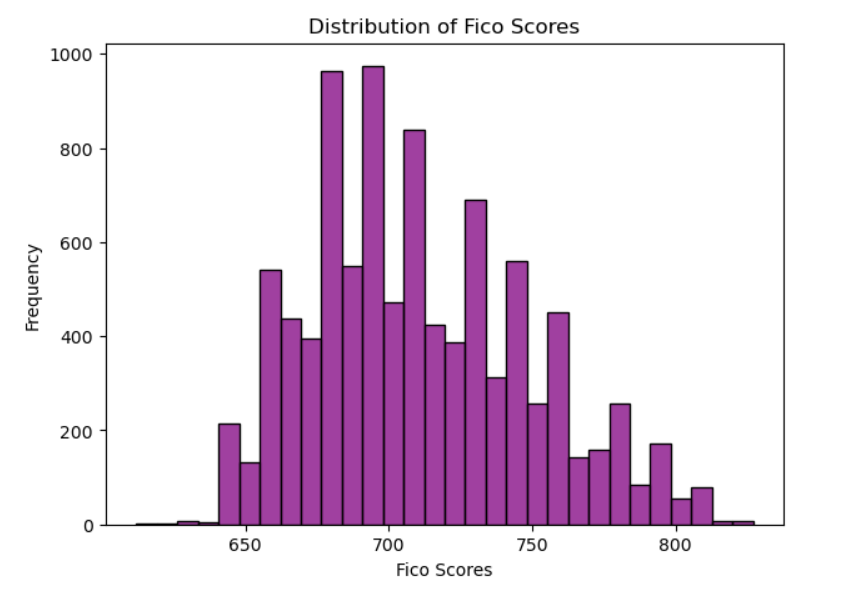
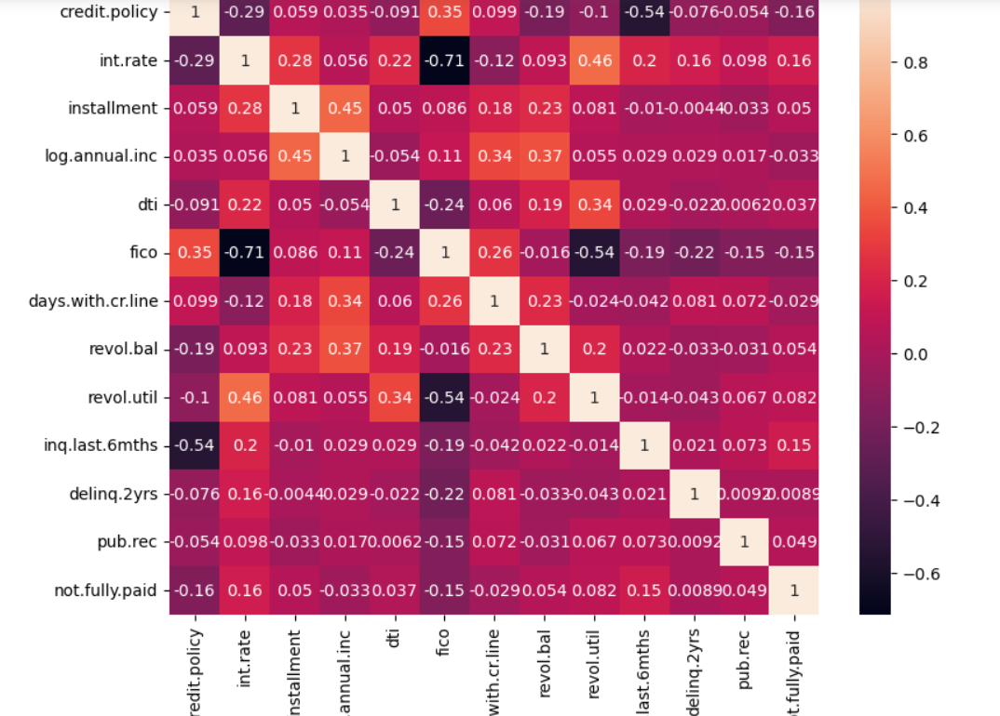
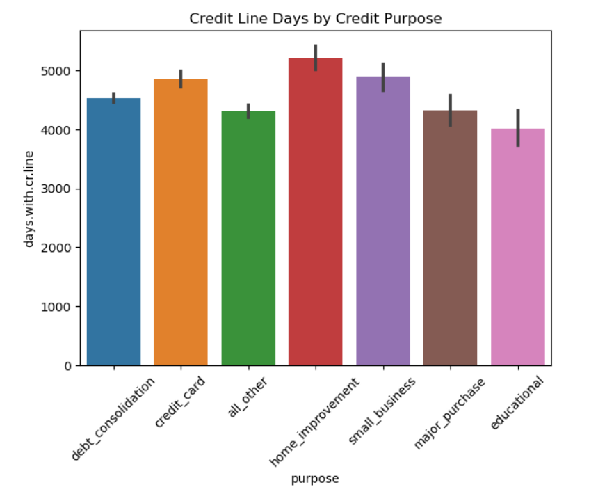
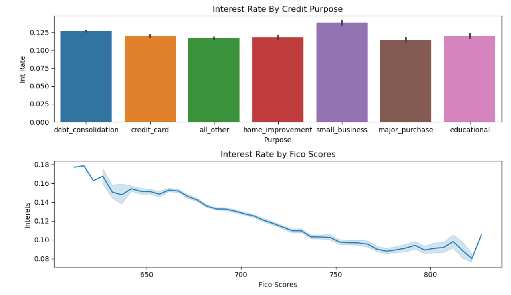
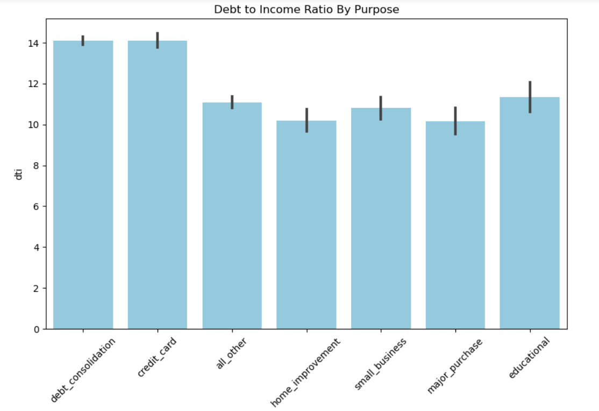
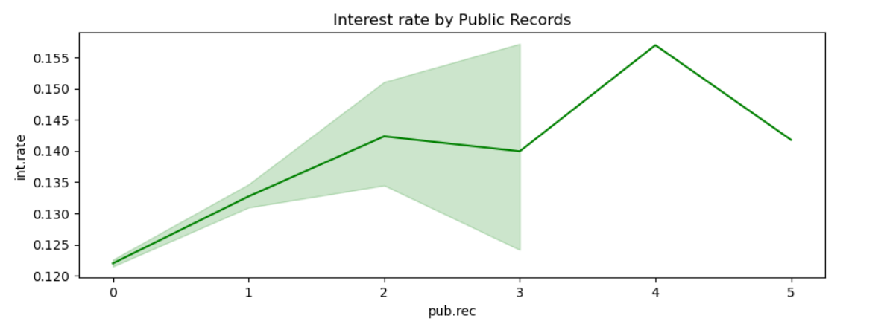
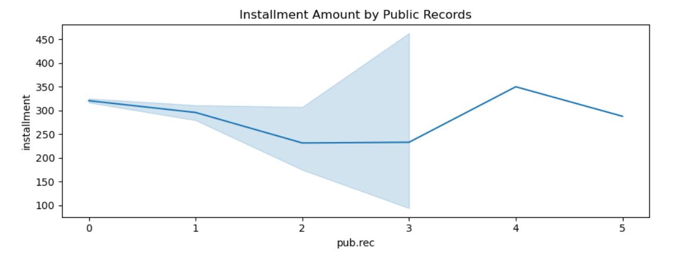

# Loan Data Exploratory Data Analysis (EDA)

## Project Objective
The main objective of this project is to analyze the trends, patterns, and correlations within the loan dataset. Through visualizations and statistical techniques, we aim to answer questions like:
What are the FICO score distribution patterns of loan applicants?
How do different loan purposes impact the interest rate and income levels?
What are the correlations between key variables like annual income, credit policy, and debt-to-income ratio?
Dataset

The dataset contains the following key features:
- FICO score: A credit score that assesses the creditworthiness of an applicant.
- Credit policy: Whether the applicant meets the lender's credit underwriting criteria.
- Loan purpose: The stated purpose of the loan (e.g., debt consolidation, credit card, home improvement, etc.).
- Interest rate: The rate of interest charged on the loan.
- Annual income: The self-reported annual income of the applicant.
- Debt-to-income ratio (DTI): The ratio of the applicant's monthly debt payments to their monthly income.
- Days with credit line: The number of days the applicant has had a credit line open.
- Delinquency: A record of late or missed payments.
- Public record: Public filings related to bankruptcy, judgments, or liens.

## EDA Process
Here’s a step-by-step breakdown of the analysis performed:

- **FICO Score Distribution**
Visualized the distribution of FICO scores for all applicants.
Key insight: Most applicants have FICO scores between 600-700, showing the majority are in the "average" credit range.
Used histograms and KDE (Kernel Density Estimation) plots to reveal the most common FICO score ranges.
- **Heatmap for Correlation**
Generated a heatmap to analyze the correlation between different numerical variables such as annual income, interest rates, debt-to-income ratios, and FICO scores.
Key insight: Strong negative correlation between FICO scores and interest rates, confirming that applicants with higher FICO scores tend to secure lower interest rates.
- **Days with Credit Line by Purpose**
Analyzed the relationship between the number of days the applicant has had a credit line and the stated loan purpose.
Key insight: Loans for debt consolidation tend to be applied by individuals with longer credit histories, indicating more financially experienced applicants.
- **Interest Rate by Loan Purpose**
Compared the interest rates across different loan purposes using box plots.
Key insight: Credit card and debt consolidation loans tend to have higher interest rates, while home improvement loans usually have lower rates. This could be due to perceived risk differences.
- **Interest Rate by FICO Scores**
Explored how interest rates vary based on applicants' FICO scores.
Key insight: As expected, higher FICO scores are associated with lower interest rates. There is a noticeable decrease in interest rates for applicants with FICO scores above 700.
- **Annual Income and Interest Rate Analysis**
Plotted the relationship between annual income and interest rates to identify trends.
Key insight: Higher-income applicants generally receive lower interest rates, though there are some exceptions, suggesting income alone may not fully determine loan terms.
- **Debt-to-Income Ratio by Loan Purpose**
Analyzed how debt-to-income (DTI) ratios vary depending on the loan purpose.
Key insight: Applicants seeking loans for credit cards and debt consolidation tend to have higher DTI ratios, indicating that these loans are often used to manage existing debt.
- **Delinquency Patterns**
Investigated the number of delinquent accounts (i.e., late or missed payments) in relation to interest rates and FICO scores.
Key insight: Applicants with a history of delinquencies face significantly higher interest rates, emphasizing the importance of maintaining good credit health.
- **Public Record Analysis (Interest Rate and Installment Amounts)**
Analyzed the impact of public records (such as bankruptcies or liens) on interest rates and installment amounts.
Key insight: Applicants with public records tend to have higher interest rates and lower installment amounts, likely reflecting lenders’ increased risk aversion.

## Key Insights
- Applicants with higher FICO scores generally receive lower interest rates.
- Loan purposes such as debt consolidation and credit card loans have a significant impact on interest rates and debt-to-income ratios.
- Delinquencies and public records heavily influence the terms and conditions offered by lenders.
- Longer credit histories are associated with lower risk and better loan terms for the applicant.

## Conclusion
This EDA project provides valuable insights into loan applicant behavior and lending risk assessment. By understanding factors like FICO scores, debt-to-income ratios, and loan purposes, financial institutions can make more informed lending decisions. Further analysis could involve predictive modeling to forecast loan defaults based on these factors.